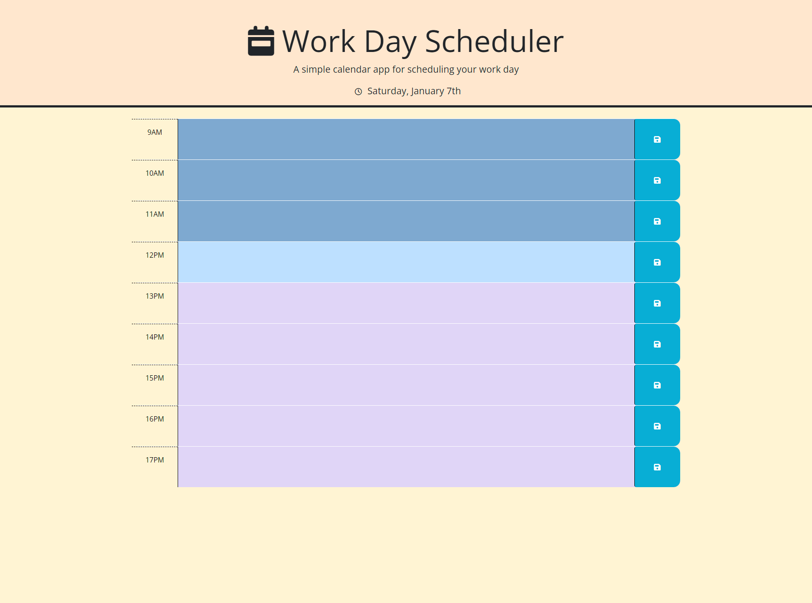

# Daily Scheduler 

## Description

A simple time block format allowing for daily scheduling. The current day and date is shown at the top as well as the blocks will change color depending on if the block is representing a time in the past, present or future. Any entries are saved to local storage when user presses save button.
## Visuals

## Link
